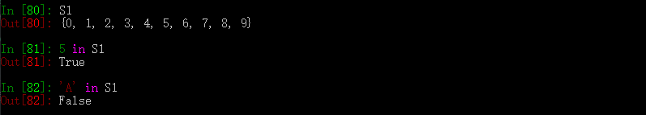

集合是一个可变的、无序的、不重复的元素的集合
- 集合的元素要求必须可以hash
- 集合内元素不可以索引
- 集合可以迭代

#### 定义和初始化

- 空集合：`s1 = set()`
- 初始化：`s2 = set(range(5))`

#### 集合的常见操作

- `add()`：增加一个元素
- `update()`：类似于`list.extend`更新元素
- `remove()`:从集合中移除一个元素,元素不存在则报错KeyError
- `discard()`：移除一个元素，院所不存在时什么也不做
- `pop()`：随机删除弹出一个元素，空集合返回KeyError
- `clear()`：清除所有元素

对于集合来说，要么加入新的元素，要么删除元素，不能左修改操作，因为结合是一个非线性的数据结构，他无法实现索引，所以我们要查询时需要遍历所有元素

