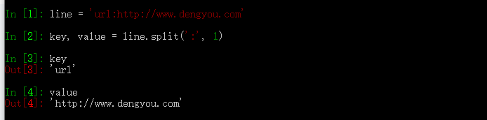
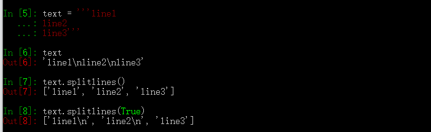
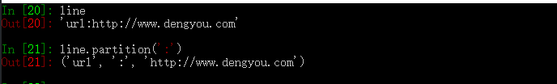
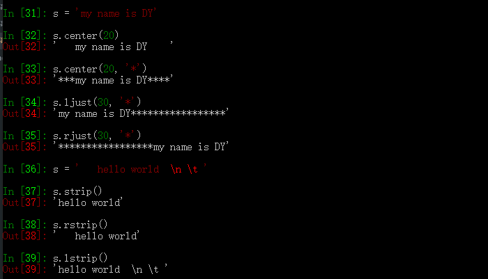
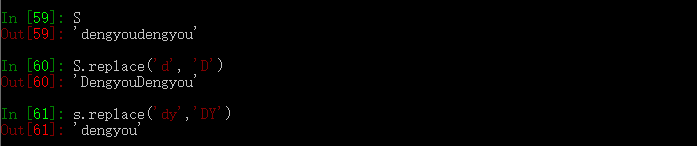

#### 字符串

字符串是有序的、不可变的对象

在Python3中字符串是一个unicode序列，在Python中是一个byte序列

#### 字符串初始化

- `s = 'dengyou'`
- `s = "dengyou"`
- `s = '''dengyou'''`
- `s = """dengyou"""`

字符串得访问：`s[2]`

#### 字符串常见操作

- 连接 `join`：` '-'.join(["hello", 'world'])`
- `+`会遍历，效率低：` '-'.join(["hello", 'world'])`

#### 字符串切片

- `split(sep=None, maxsplit=-1) `：以`sep`作为字符串得分隔符，返回一个列表，默认去除`sep`,sep默认为空格，maxsplit为列表元素的最大索引
- `rsplit(sep=None, maxsplit=-1)`：同split，从右向左进行分割

- `splitlines(keepends=False)`：按行进行分割,keepends保留换行符

- `partition(sep, /)`：从左至右，返回一个三元组
- `rpartition(sep, /)`：从左至右，返回一个三元组

#### 字符串的修改---大小写

- `capitalize`：首字母大写
- `title`：每个单词的首字母大写
- `lower`：转换为小写字母
- `upper`：转换为大写字母
- `swapcase`：将字母的大小写反转

#### 字符串的修改---填充清除

- `center`：居中显示
- `ljust`：左对齐，右边补全
- `rjust`：右对齐，左边补全
- `zfill`：右对齐，左边用0补全
- `strip`：去掉空白字符
- `lstrip`：去掉前面的空白和制表符
- `rstrip`：去掉后面的空白和制表符

#### 字符串判断

- `S.startswith(prefix[, start[, end]]) -> bool`：以某个字符开头
- `S.startswith(prefix[, start[, end]]) -> bool`：以某个字符结尾

#### 字符串的查找/替换

- ` S.count(sub[, start[, end]]) -> int`：统计一个字符串出现的字数
- ` S.find(sub[, start[, end]]) -> int`：查找某字符串出现的位置
- ` S.index(sub[, start[, end]]) -> int`：同上
- ` S.rfind(sub[, start[, end]]) -> int`：从右至左查找位置
- ` S.rindex(sub[, start[, end]]) -> int`：从右至左查找位置

> find与index的区别** 当查找一个不存在的字符时，find的返回值是-1，而index会报错

- `replace(old, new, count=-1, /)`：替换，只能从左向右进行匹配

