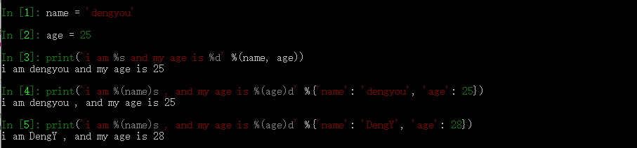
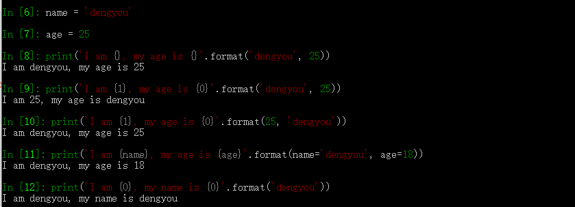

#### 字符串的格式化输出

- 结构：`template % tuple` 或者 `template % dic`



- `format方法`



- 居中对齐`:^`
- 左对齐`:<`
- 右对齐：`:>`/`:=`

```
In [1]: print('{0:^30}'.format('dengyou'))
           dengyou

In [2]: print('{0:^{width}}'.format('dengyou', width=30))
           dengyou

In [3]: print('{0:#^{width}}'.format('dengyou', width=30))
###########dengyou############

In [4]: print('{0:*^{width}}'.format('dengyou', width=30))
***********dengyou************

In [5]: print('{0:{filter}^{width}}'.format('dengyou', width=30, filter='*'))
***********dengyou************
```

```
In [1]: print('{0:^30}'.format('dengyou'))
           dengyou

In [2]: print('{0:^{width}}'.format('dengyou', width=30))
           dengyou

In [3]: print('{0:#^{width}}'.format('dengyou', width=30))
###########dengyou############

In [4]: print('{0:*^{width}}'.format('dengyou', width=30))
***********dengyou************

In [5]: print('{0:{filter}^{width}}'.format('dengyou', width=30, filter='*'))
***********dengyou************
```
